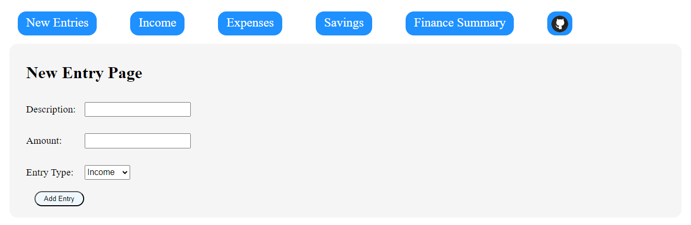

# Finance Management App

The Financial Management App is designed to help users manage their income, expenses, and savings effectively. It provides a user-friendly interface for tracking financial transactions and generating reports to gain insights into their financial health.

#### Live Link - https://finance-management-zeta.vercel.app/
#### Backend - https://github.com/ShivamT16/assignment-19

## Features-

Income Management  
<li>Users can add income entries, including a description and amount.
<li>They can view a list of their income transactions on the Income Page with sort and filter functionality.  

 
Expense Management  

 
<li>Users can add expense entries, including a description, amount, and category.
<li>They can view a list of their expense transactions on the Expense Page with sort and filter functionality.

 
Savings Management  

 
<li>Users can add savings entries, including a description and amount.
<li>They can view a list of their savings transactions on the Savings Page with sort and filter functionality.

 
Financial Reports

 
<li>Income vs. Expenses: A summary of total income, total expenses, and savings.
<li>Expense Breakdown: A breakdown of expenses by category.

## Tech Used

Frontend-  
Javascript  
HTML  
ReactJs  
Redux  

Backend-  
NodeJs  
Express  
MongoDB 